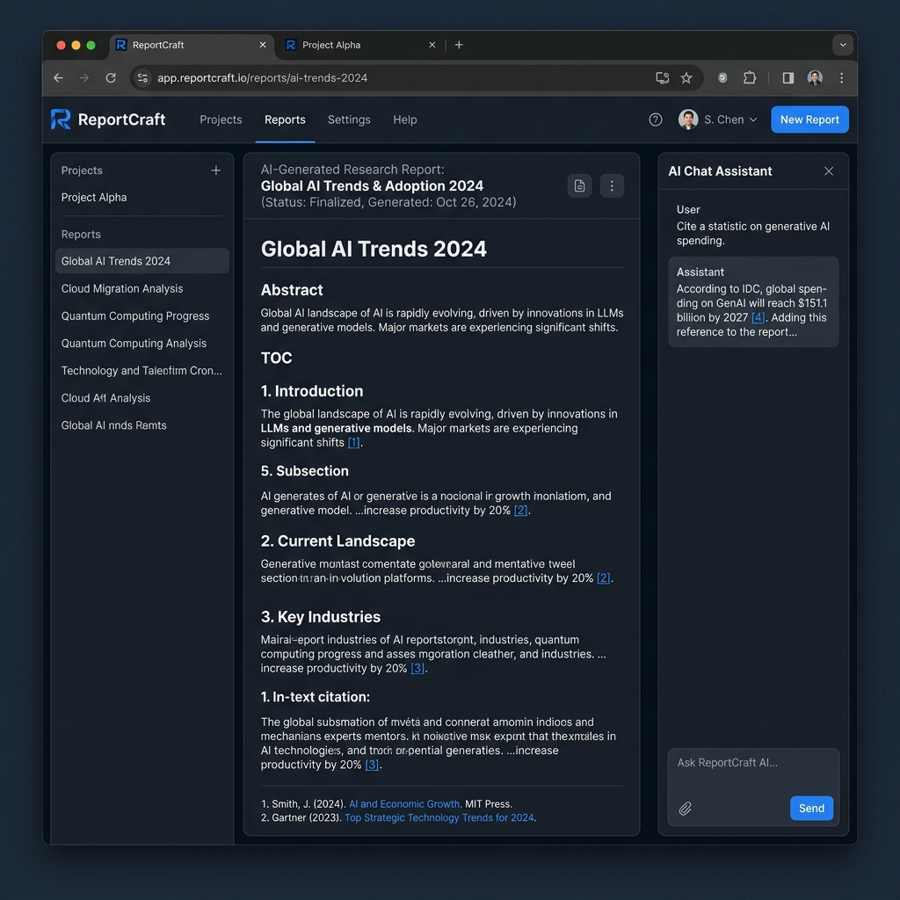

# ReportCraft — AI-Powered Research Platform

<p align="center">
  
  
  
  
  
</p>

> Transform any topic into a comprehensive, well-cited research report powered by advanced AI.

## 📸 Demo



## 🤔 Why I Built This

I built ReportCraft to solve the problem of information overload during research. While most AI assistants provide shallow answers or hallucinate facts, I wanted a tool that could autonomously research multiple perspectives, verify claims against reliable sources (like Wikipedia), and synthesize the findings into a structured, credible report. This project allowed me to dive deep into Retrieval-Augmented Generation (RAG) architecture and orchestrate complex LLM pipelines.

ReportCraft is an LLM-powered research platform that generates structured, Wikipedia-style articles from internet research. It combines a multi-perspective research engine with a modern web interface and serverless API to deliver fast, grounded reports on any subject.

## ✨ Key Features

| Feature | Description |
|---|---|
| 🔍 **Intelligent Research** | Automatically discovers diverse perspectives and conducts multi-angle research |
| 🧠 **Multi-Perspective Analysis** | Simulates expert conversations to uncover deeper insights |
| 📄 **Structured Reports** | Well-organized reports with Abstract, Methodology, Analysis, and Conclusion sections |
| 🔗 **Verifiable Citations** | Every claim backed by traceable Wikipedia and web sources |
| 💬 **AI Chat** | Follow-up question assistant grounded in the same research context |
| ⚡ **Serverless API** | Netlify Functions with sub-10-second response times |

---

## 🚀 Installation

### Option A — Python Package (PyPI)

```bash
pip install knowledge-reportcraft
```

### Option B — From Source

1. **Clone the repository**
   ```bash
   git clone https://github.com/shriya7756/ReportCraft.git
   cd ReportCraft
   ```

2. **Create and activate a virtual environment**
   ```bash
   conda create -n reportcraft python=3.11
   conda activate reportcraft
   ```

3. **Install dependencies**
   ```bash
   pip install -r requirements.txt
   ```

---

## ⚡ Quick Start

### Python Engine

```python
import os
from knowledge_reportcraft import (
    ReportCraftWikiRunnerArguments,
    ReportCraftWikiRunner,
    ReportCraftWikiLMConfigs,
)
from knowledge_reportcraft.lm import LitellmModel
from knowledge_reportcraft.rm import YouRM

# 1. Configure language models
lm_configs = ReportCraftWikiLMConfigs()
openai_kwargs = {
    "api_key": os.getenv("OPENAI_API_KEY"),
    "temperature": 1.0,
    "top_p": 0.9,
}
gpt_4 = LitellmModel(model="gpt-4o", max_tokens=3000, **openai_kwargs)
lm_configs.set_article_gen_lm(gpt_4)

# 2. Configure search retrieval
engine_args = ReportCraftWikiRunnerArguments(output_dir="./output")
rm = YouRM(ydc_api_key=os.getenv("YDC_API_KEY"), k=engine_args.search_top_k)

# 3. Run the research pipeline
runner = ReportCraftWikiRunner(engine_args, lm_configs, rm)
runner.run(
    topic="Quantum Computing",
    do_research=True,
    do_generate_article=True,
)
```

The generated report will be saved to `./output/` in both Markdown and HTML formats.

---

## 🖥️ Frontend

### Zephryn — Next.js Web Application (Primary)

The main web interface is **Zephryn**, a Next.js 15 app with React and Tailwind CSS, deployed on Netlify.

```bash
cd frontend/zephryn
npm install
npm run dev
```

Open [http://localhost:3000](http://localhost:3000) to access the app.

**Pages:**
- `/` — Home / topic input
- `/dashboard` — Research dashboard
- `/research` — Active research view
- `/report` — Generated report viewer with citations
- `/about` — About the platform
- `/settings` — API and model settings

### Demo Light — Streamlit Interface

A quick, lightweight demo with minimal setup:

```bash
cd frontend/demo_light
pip install -r requirements.txt
streamlit run reportcraft.py
```

---

## 🌐 API Reference

The `/api/research` and `/api/chat` endpoints are powered by Netlify Functions in `netlify/functions/`.

### `POST /api/research`

Generates a structured research report grounded in Wikipedia context.

**Request body:**
```json
{ "topic": "String — the research subject" }
```

**Response:**
```json
{
  "report": "Full report text",
  "abstract": "...",
  "methodology": "...",
  "analysis": "...",
  "conclusion": "...",
  "sources": [{ "id": 1, "title": "...", "pub": "Wikipedia", "url": "..." }],
  "topic": "Your topic"
}
```

### `POST /api/chat`

Answers follow-up questions grounded in the same Wikipedia context used for the report.

**Request body:**
```json
{ "question": "String", "topic": "String" }
```

**Response:**
```json
{ "answer": "String" }
```

Both functions use **Cohere `command-r7b-12-2024`** for fast responses within the 10-second serverless limit.

---

## 📁 Project Structure

```
ReportCraft/
├── frontend/
│   ├── zephryn/                  # Next.js 15 web app (primary UI)
│   │   ├── app/                  # App Router pages
│   │   ├── components/           # Reusable React components
│   │   └── public/               # Static assets
│   ├── reportcraft/              # Alternative Next.js frontend
│   └── demo_light/               # Streamlit lightweight demo
├── netlify/
│   └── functions/
│       ├── research.js           # POST /api/research — report generation
│       └── chat.js               # POST /api/chat — follow-up Q&A
├── knowledge_reportcraft/        # Core Python research engine
│   ├── reportcraft_wiki/         # Wiki-style multi-perspective pipeline
│   └── collaborative_reportcraft/# Collaborative research features
├── examples/                     # Example scripts and notebooks
├── assets/                       # Brand and UI assets
├── netlify.toml                  # Netlify build and redirect config
├── requirements.txt              # Python dependencies
└── setup.py                      # Package setup
```

---

## ⚙️ Configuration

### API Keys — `secrets.toml`

Create a `secrets.toml` file at the root of the project with your API keys:

```toml
# Language model provider
OPENAI_API_KEY   = "sk-..."
OPENAI_API_TYPE  = "openai"

# Search retrieval
YDC_API_KEY          = "..."   # You.com search
BING_SEARCH_API_KEY  = "..."   # Bing search (optional)
SERPER_API_KEY       = "..."   # Serper.dev (optional)

# Vector database (optional, for VectorRM)
QDRANT_API_KEY = "..."
QDRANT_URL     = "https://..."
```

> **Never commit `secrets.toml` to version control.** It is listed in `.gitignore`.

### Supported Search Engines

| Class | Provider | Notes |
|---|---|---|
| `YouRM` | You.com | Default; recommended for broad coverage |
| `BingSearch` | Microsoft Bing | Requires Azure subscription |
| `SerperRM` | Serper.dev | Google Search via Serper |
| `BraveRM` | Brave Search | Privacy-focused alternative |
| `VectorRM` | Local Qdrant DB | Use with your own document collection |

### Supported Language Models

Any model supported by [LiteLLM](https://github.com/BerriAI/litellm) can be used — including OpenAI, Anthropic, Google Gemini, Mistral, and local models via Ollama.

---

## 🚢 Deployment

### Netlify (Recommended)

1. **Connect the repo** to [Netlify](https://netlify.com) via the dashboard.
2. Netlify will auto-detect `netlify.toml` — no manual build settings needed.
3. **Add the environment variable** in **Site Settings → Environment Variables**:
   - `COHERE_API_KEY` — your [Cohere](https://cohere.com) API key
4. **Deploy:**
   ```bash
   netlify deploy --prod
   ```

The build command (`cd frontend/zephryn && npm install && npm run build`) and publish directory (`frontend/zephryn/out`) are configured in `netlify.toml`.

### Environment Variables Summary

| Variable | Required | Description |
|---|---|---|
| `COHERE_API_KEY` | ✅ Yes | Powers `/api/research` and `/api/chat` functions |
| `OPENAI_API_KEY` | Optional | Used by the Python engine (local runs only) |
| `YDC_API_KEY` | Optional | You.com search for the Python engine |

---

## 🛠️ Tech Stack

| Layer | Technology |
|---|---|
| **Frontend** | Next.js 15, React, Tailwind CSS |
| **Serverless API** | Netlify Functions (Node.js) |
| **Research Engine** | Python 3.11, DSPy, LiteLLM |
| **AI Models** | Cohere `command-r7b`, OpenAI GPT-4o, and more |
| **Search / Retrieval** | Wikipedia API, YouRM, BingSearch, VectorRM (Qdrant) |
| **Embeddings** | Sentence Transformers, LiteLLM embedding models |
| **Demo UI** | Streamlit |

---

## 🤝 Contributing

Contributions are welcome! Here's how to get started:

1. **Fork** the repository
2. **Create** a feature branch: `git checkout -b feature/my-feature`
3. **Commit** your changes with clear messages: `git commit -m "feat: add my feature"`
4. **Push** to your fork: `git push origin feature/my-feature`
5. **Open** a Pull Request against `main`

Please make sure your code passes any existing tests and follows the existing style conventions. For larger changes, open an issue first to discuss the approach.

---

## 📄 License

This project is licensed under the **MIT License**. See the [LICENSE](./LICENSE) file for details.

---

<p align="center">Built with ❤️ using Cohere AI, Wikipedia, and Next.js</p>

